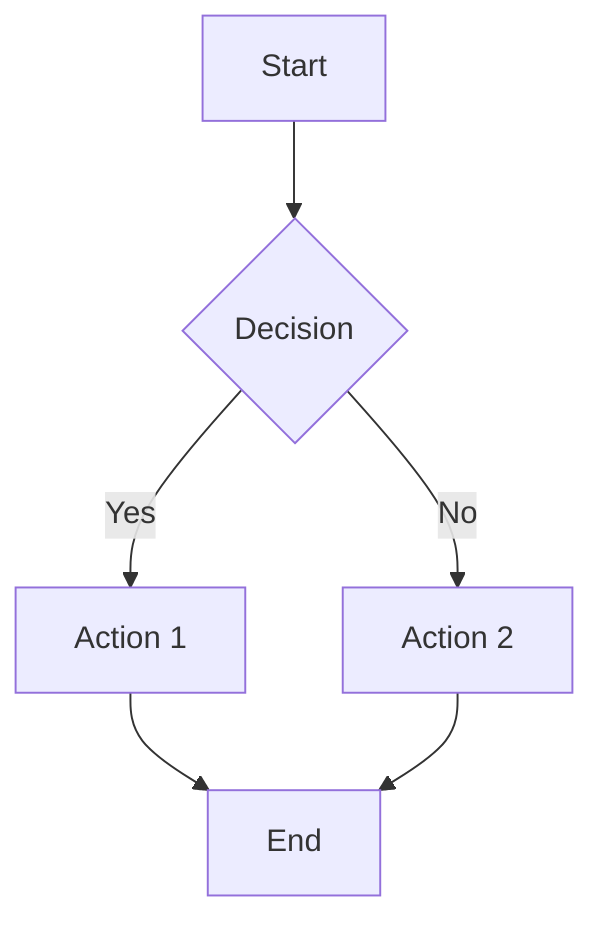
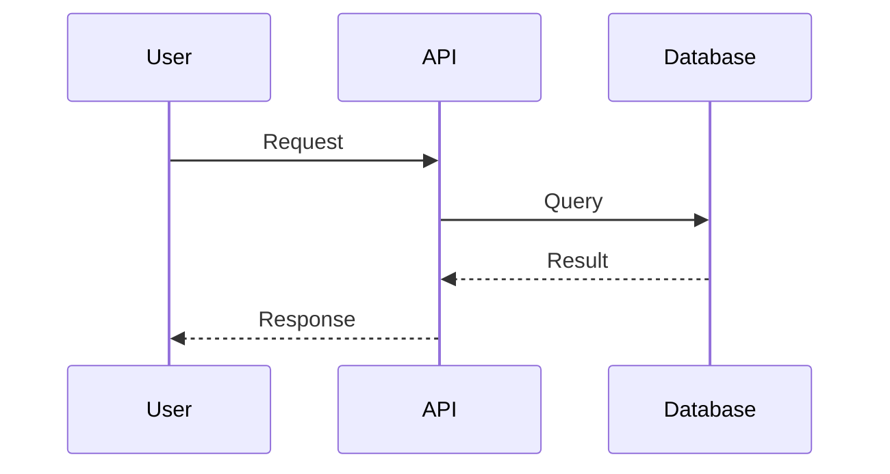
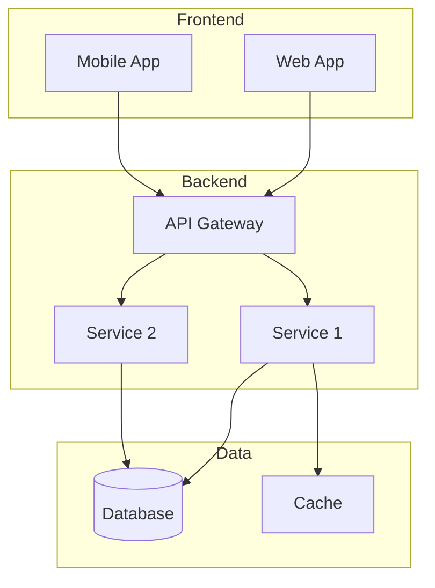

# Diagram Generator

Generate professional Visio-style diagrams for software engineering documents using Node.js libraries.

## Overview

Creates flowcharts, architecture diagrams, UML diagrams, and data flow charts that can be embedded in documentation.

## Supported Diagram Types

1. **Flowcharts** - Process flows, decision trees
2. **Architecture Diagrams** - System components, layers
3. **UML Diagrams** - Class diagrams, sequence diagrams
4. **Data Flow Diagrams** - DFD, ER diagrams
5. **Sequence Diagrams** - Interaction flows
6. **State Diagrams** - State machines

## Workflow

1. **Identify diagram type** - Determine best visualization
2. **Generate diagram code** - Create Mermaid/PlantUML syntax
3. **Render to image** - Convert to PNG/SVG
4. **Embed in document** - Reference generated image

## Output Formats

- PNG (high resolution)
- SVG (scalable)
- PDF (print quality)

## Diagram Code Examples

### Flowchart (Mermaid)

### Sequence Diagram (Mermaid)

### Architecture (Mermaid)

## Resources

### scripts/

- `render-diagram.js` - Render Mermaid/PlantUML to image
- `mermaid-to-png.js` - Convert Mermaid to PNG
