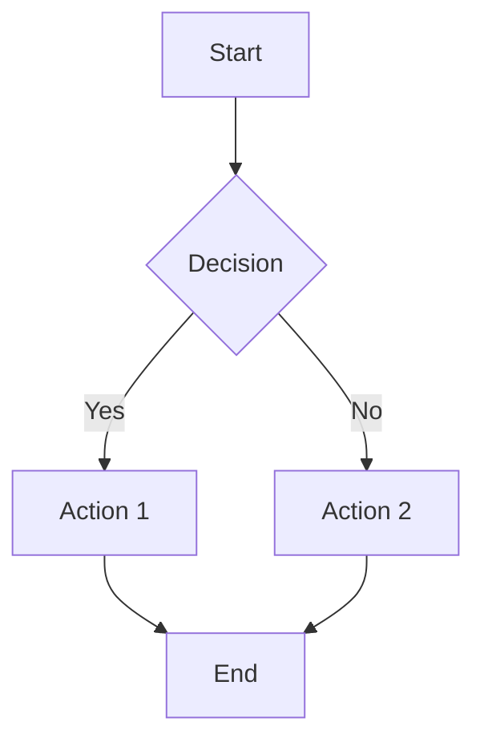
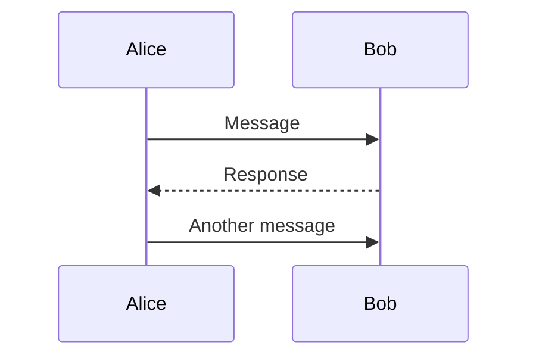
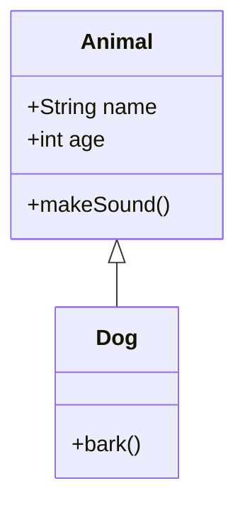
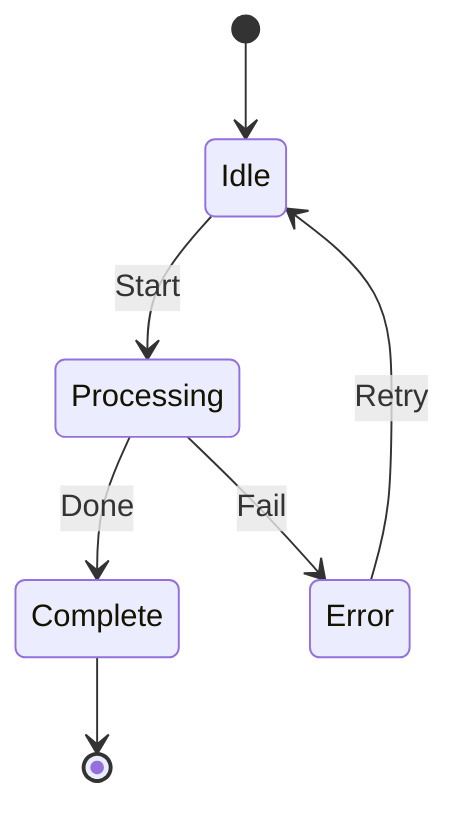
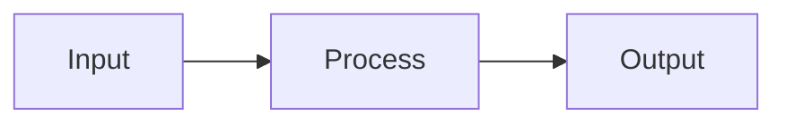
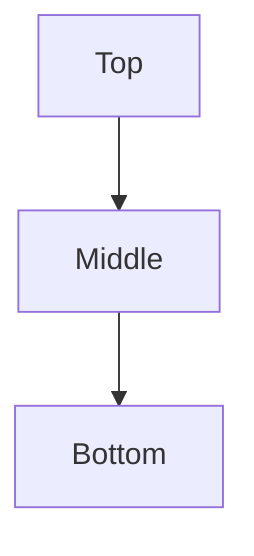
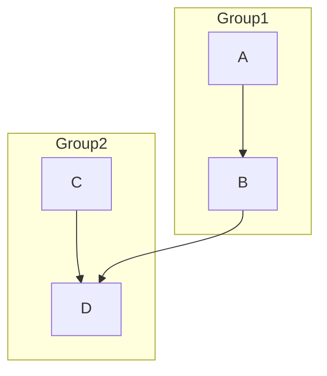

# Mermaid Diagram Guide

Quick reference for Mermaid syntax used in diagram generation.

## Flowchart



### Node Shapes
- `[Rectangle]` - Process
- `(Rounded]` - Rounded rectangle
- `((Circle))` - Circle
- `[Diamond]` - Decision
- `[[Subroutine]]` - Subroutine
- `[(Cylinder)]` - Database

### Arrow Types
- `-->` - Arrow
- `---` - Line
- `-.->` - Dotted arrow
- `==>` - Thick arrow

## Sequence Diagram



## Class Diagram



## State Diagram



## Entity Relationship

```mermaid
erDiagram
    CUSTOMER ||--o{ ORDER : places
    ORDER ||--|{ LINE-ITEM : contains
    PRODUCT ||--o{ LINE-ITEM : "is in"
}
```

## Common Patterns

### Horizontal Flow


### Vertical Flow


### Subgraph (Grouping)


## Export Options

### VS Code Extension
Install "Markdown Preview Mermaid Support" or "Mermaid Markdown Syntax Highlighting"

### CLI Tools
- `@mermaid-js/mermaid-cli` - Command line rendering
- `mermaid-cli` - Standalone CLI

### Online Editors
- https://mermaid.live - Live Mermaid editor
- https://knsv.github.io/mermaid/ - Official demos
