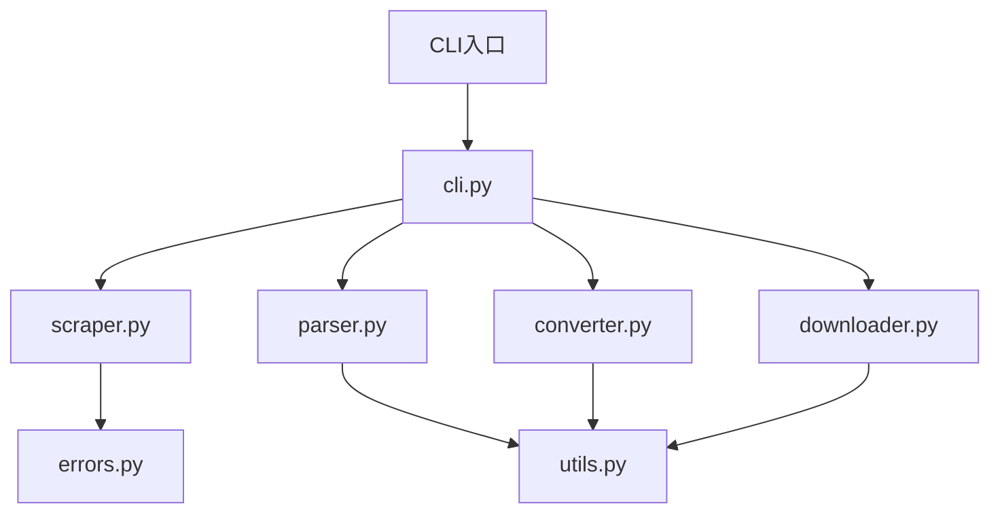

# 代码审查报告

## 基本信息

- **审查日期**: 2026-06-09
- **项目名称**: wechat-article-for-ai
- **审查范围**: Config/.agent-reach/tools/wechat-article-for-ai/ 目录下所有 Python 代码文件
- **文件数量**: 9 个 Python 文件

---

## 🎯 代码结构概览



---

## 🔍 问题列表

| No. | 问题标题 | 严重程度 | 建议 | 代码位置 |
|-----|---------|---------|------|---------|
| 1 | 代码块索引可能越界 | 🔴 高 | 在使用 `len(blocks) - 1` 前检查 blocks 是否为空 | [parser.py#L129](file:///D:/Develop/CODE/AIWORK/Config/.agent-reach/tools/wechat-article-for-ai/wechat_to_md/parser.py#L129) |
| 2 | 图片下载路径未验证 | 🟡 中 | 在写入文件前确保目录存在 | [downloader.py#L54](file:///D:/Develop/CODE/AIWORK/Config/.agent-reach/tools/wechat-article-for-ai/wechat_to_md/downloader.py#L54) |
| 3 | 资源泄漏风险 | 🟡 中 | 重试循环中每次创建新的浏览器实例可能导致资源泄漏 | [scraper.py#L44](file:///D:/Develop/CODE/AIWORK/Config/.agent-reach/tools/wechat-article-for-ai/wechat_to_md/scraper.py#L44) |
| 4 | 日志信息不准确 | 🟢 低 | 使用成功下载的图片数而非总图片数 | [cli.py#L149](file:///D:/Develop/CODE/AIWORK/Config/.agent-reach/tools/wechat-article-for-ai/wechat_to_md/cli.py#L149) |
| 5 | 异常处理过于宽泛 | 🟡 中 | `infer_image_extension` 使用宽泛的 Exception 捕获 | [utils.py#L69](file:///D:/Develop/CODE/AIWORK/Config/.agent-reach/tools/wechat-article-for-ai/wechat_to_md/utils.py#L69) |
| 6 | 日志配置检查不健壮 | 🟢 低 | 多次调用 setup_logging 时的处理逻辑不完善 | [utils.py#L19](file:///D:/Develop/CODE/AIWORK/Config/.agent-reach/tools/wechat-article-for-ai/wechat_to_md/utils.py#L19) |

---

## 📝 详细问题分析

### 问题1：代码块索引可能越界

**位置**: `parser.py` 第129行

```python
placeholder.string = f"CODEBLOCK-PLACEHOLDER-{len(blocks) - 1}"
```

**问题描述**: 如果 `blocks` 列表为空，`len(blocks) - 1` 会返回 `-1`。虽然这不影响功能（占位符会变成 `CODEBLOCK-PLACEHOLDER--1`），但逻辑上不够严谨。

**建议**: 在添加代码块到列表后再生成占位符，或者使用已添加的索引。

---

### 问题2：图片下载路径未验证

**位置**: `downloader.py` 第54行

```python
filepath = img_dir / filename
filepath.write_bytes(resp.content)
```

**问题描述**: 虽然在第91行创建了目录，但 `download_single_image` 函数本身没有确保目录存在的逻辑。如果调用者没有正确创建目录，会导致文件写入失败。

**建议**: 在写入文件前添加目录存在检查，或者在函数开头确保目录存在。

---

### 问题3：资源泄漏风险

**位置**: `scraper.py` 第44行

```python
async with AsyncCamoufox(headless=headless) as browser:
```

**问题描述**: 在重试循环内部创建浏览器实例。如果每次重试都失败，虽然使用了 `async with` 确保资源释放，但频繁创建和销毁浏览器实例可能会有资源泄漏风险。

**建议**: 考虑将浏览器创建移到重试循环外部，或者增加更完善的资源清理机制。

---

### 问题4：日志信息不准确

**位置**: `cli.py` 第149行

```python
logger.info(f"Saved: {md_path} ({len(final_md)} chars, {len(parsed.image_urls)} images)")
```

**问题描述**: 日志显示的是 `parsed.image_urls` 的长度（总图片数），而不是实际下载成功的图片数。这可能会造成误导。

**建议**: 使用实际下载成功的图片数进行日志记录。

---

### 问题5：异常处理过于宽泛

**位置**: `utils.py` 第69行

```python
except Exception:
    pass
```

**问题描述**: 使用 `except Exception` 捕获所有异常过于宽泛，可能会隐藏一些不应该被忽略的严重错误。

**建议**: 明确捕获可能的异常类型，如 `ValueError`、`KeyError` 等。

---

### 问题6：日志配置检查不健壮

**位置**: `utils.py` 第19行

```python
if logger.handlers:
    return logger
```

**问题描述**: 如果 handlers 被清空或重置，这个检查可能不够可靠。多次调用 `setup_logging` 时可能会导致日志配置不一致。

**建议**: 使用更可靠的方式检查日志是否已经配置，例如使用标志位。

---

## ✅ 代码优点

1. **良好的异常层次结构**: `errors.py` 定义了清晰的异常继承体系
2. **合理的代码组织**: 按功能模块划分文件，职责清晰
3. **充分的日志记录**: 关键节点都有适当的日志输出
4. **重试机制完善**: 网络请求和图片下载都有重试逻辑
5. **类型提示完善**: 使用了 `from __future__ import annotations` 和类型提示
6. **代码注释清晰**: 函数和模块都有适当的文档字符串

---

## 📊 总结

### 问题严重程度分布

| 严重程度 | 数量 | 占比 |
|---------|------|-----|
| 🔴 高 | 1 | 17% |
| 🟡 中 | 3 | 50% |
| 🟢 低 | 2 | 33% |

### 建议修复优先级

1. **优先**: 问题1（索引越界风险）
2. **次优先**: 问题3（资源泄漏风险）、问题5（异常处理过于宽泛）
3. **后续**: 问题2（路径验证）、问题4（日志准确性）、问题6（日志配置）

项目整体代码质量较高，结构清晰，主要问题集中在边界条件处理和资源管理方面。

---

## 📁 审查文件列表

| 文件路径 | 行数 | 功能描述 |
|---------|------|---------|
| [cli.py](file:///D:/Develop/CODE/AIWORK/Config/.agent-reach/tools/wechat-article-for-ai/wechat_to_md/cli.py) | 259 | CLI入口，处理命令行参数和文章处理流程 |
| [converter.py](file:///D:/Develop/CODE/AIWORK/Config/.agent-reach/tools/wechat-article-for-ai/wechat_to_md/converter.py) | 138 | Markdown转换，HTML转MD，图片URL替换 |
| [downloader.py](file:///D:/Develop/CODE/AIWORK/Config/.agent-reach/tools/wechat-article-for-ai/wechat_to_md/downloader.py) | 112 | 异步图片下载，支持重试和并发控制 |
| [errors.py](file:///D:/Develop/CODE/AIWORK/Config/.agent-reach/tools/wechat-article-for-ai/wechat_to_md/errors.py) | 17 | 自定义异常类定义 |
| [mcp_server.py](file:///D:/Develop/CODE/AIWORK/Config/.agent-reach/tools/wechat-article-for-ai/wechat_to_md/mcp_server.py) | 6 | MCP服务器入口 |
| [parser.py](file:///D:/Develop/CODE/AIWORK/Config/.agent-reach/tools/wechat-article-for-ai/wechat_to_md/parser.py) | 210 | HTML解析，提取元数据和内容处理 |
| [scraper.py](file:///D:/Develop/CODE/AIWORK/Config/.agent-reach/tools/wechat-article-for-ai/wechat_to_md/scraper.py) | 92 | 页面抓取，使用Camoufox获取渲染HTML |
| [utils.py](file:///D:/Develop/CODE/AIWORK/Config/.agent-reach/tools/wechat-article-for-ai/wechat_to_md/utils.py) | 100 | 工具函数，日志、文件名处理、时间戳等 |

---

**报告生成时间**: 2026-06-09
**报告版本**: v1.0