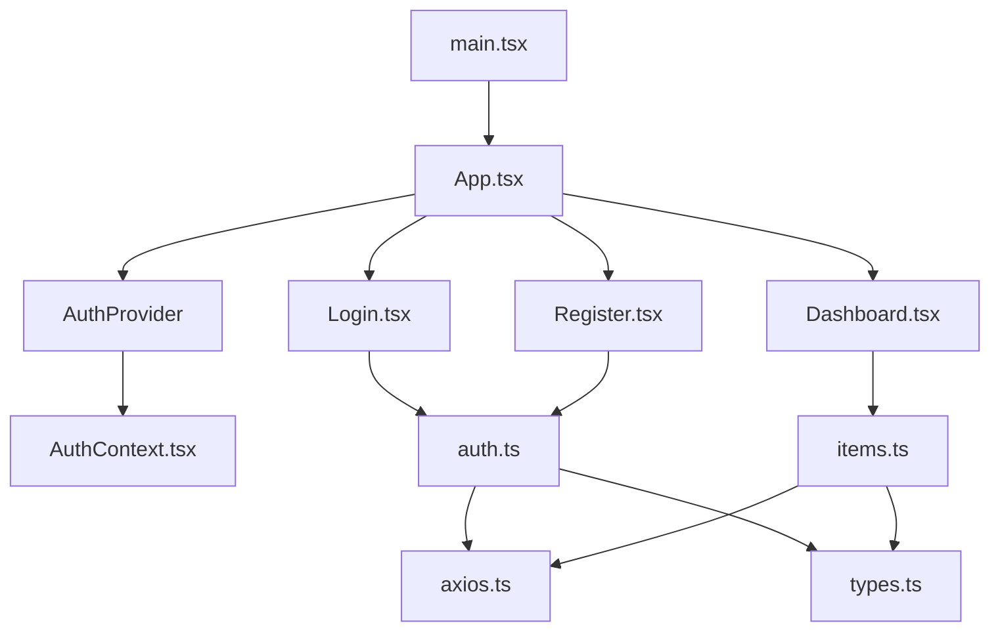

# 前端项目代码审查报告

## 基本信息

- **审查日期**: 2026-06-09
- **项目名称**: frontend (React + TypeScript)
- **审查范围**: Projects/frontend/src/ 目录下所有代码文件
- **文件数量**: 11 个 TypeScript/TSX 文件

---

## 🎯 代码结构概览



---

## 🔍 问题列表

| No. | 问题标题 | 严重程度 | 建议 | 代码位置 |
|-----|---------|---------|------|---------|
| 1 | 类型定义不一致 | 🟡 中 | 统一 `userId` 和 `id` 的类型定义 | [types.ts#L2](file:///D:/Develop/CODE/AIWORK/Projects/frontend/src/api/types.ts#L2) |
| 2 | API 参数设计问题 | 🟡 中 | `getItems` 的可选参数设计不合理 | [items.ts#L4](file:///D:/Develop/CODE/AIWORK/Projects/frontend/src/api/items.ts#L4) |
| 3 | 错误处理过于宽泛 | 🟡 中 | 登录/注册组件缺少错误类型区分 | [Login.tsx#L31](file:///D:/Develop/CODE/AIWORK/Projects/frontend/src/components/Login.tsx#L31) |
| 4 | 缺少请求取消机制 | 🟡 中 | 组件卸载时未取消进行中的请求 | [Dashboard.tsx#L24](file:///D:/Develop/CODE/AIWORK/Projects/frontend/src/components/Dashboard.tsx#L24) |
| 5 | 使用原生 confirm | 🟢 低 | 删除确认使用原生弹窗影响用户体验 | [Dashboard.tsx#L77](file:///D:/Develop/CODE/AIWORK/Projects/frontend/src/components/Dashboard.tsx#L77) |
| 6 | localStorage 缺少错误处理 | 🟡 中 | AuthContext 读取 localStorage 时未捕获异常 | [AuthContext.tsx#L26](file:///D:/Develop/CODE/AIWORK/Projects/frontend/src/context/AuthContext.tsx#L26) |
| 7 | 密码强度未验证 | 🟢 低 | 注册页面缺少密码强度检查 | [Register.tsx#L29](file:///D:/Develop/CODE/AIWORK/Projects/frontend/src/components/Register.tsx#L29) |

---

## 📝 详细问题分析

### 问题1：类型定义不一致

**位置**: `types.ts` 第2、11、23行

```typescript
export interface User {
  userId: string | number;  // 第2行
  ...
}

export interface AuthResponse {
  data: {
    userId: string | number;  // 第11行
    ...
  };
}

export interface Item {
  id: string | number;  // 第23行
  ...
}
```

**问题描述**: `userId` 和 `id` 都定义为 `string | number`，但在实际使用时（如 `Dashboard.tsx` 第65行和第79行）需要转换为字符串，这表明后端可能统一使用字符串ID。

**建议**: 统一类型定义，根据后端实际返回格式确定是 `string` 还是 `number`。

---

### 问题2：API 参数设计问题

**位置**: `items.ts` 第4-7行

```typescript
export const getItems = async (id?: string): Promise<ItemsResponse> => {
  const params = id ? { id } : {};
  const response = await api.get('/items', { params });
  return response.data;
};
```

**问题描述**: `getItems` 函数设计了一个可选的 `id` 参数，但根据 RESTful API 规范，获取单个资源应该使用 `/items/:id`，而不是 `/items?id=xxx`。

**建议**: 将获取单个项目和获取项目列表分离为两个函数：`getItems()` 和 `getItem(id: string)`。

---

### 问题3：错误处理过于宽泛

**位置**: `Login.tsx` 第31-32行，`Register.tsx` 第38-39行

```typescript
// Login.tsx
} catch (err) {
  setError('Invalid credentials');
}

// Register.tsx  
} catch (err) {
  setError('User already exists or registration failed');
}
```

**问题描述**: 错误处理过于宽泛，没有区分不同类型的错误（如网络错误、验证错误、服务器错误等）。

**建议**: 根据错误类型提供更具体的错误信息，例如：
- 网络错误："Network error, please try again"
- 401错误："Invalid email or password"
- 409错误："User already exists"

---

### 问题4：缺少请求取消机制

**位置**: `Dashboard.tsx` 第24行

```typescript
useEffect(() => {
  fetchItems();
}, []);
```

**问题描述**: 组件挂载时发起异步请求，但在组件卸载时没有取消请求。如果请求在组件卸载后才完成，会导致状态更新错误。

**建议**: 使用 `axios.CancelToken` 或 React Query 等工具来管理请求生命周期。

---

### 问题5：使用原生 confirm

**位置**: `Dashboard.tsx` 第77行

```typescript
if (confirm('Are you sure you want to delete this item?')) {
```

**问题描述**: 使用浏览器原生的 `confirm` 弹窗，用户体验不佳且样式无法自定义。

**建议**: 实现自定义的确认对话框组件以保持一致的用户体验。

---

### 问题6：localStorage 缺少错误处理

**位置**: `AuthContext.tsx` 第26行

```typescript
setUser(JSON.parse(storedUser));
```

**问题描述**: 读取 `localStorage` 时没有捕获可能的异常。如果存储的数据格式不正确，`JSON.parse` 会抛出异常。

**建议**: 使用 try-catch 包裹 localStorage 操作。

---

### 问题7：密码强度未验证

**位置**: `Register.tsx` 第29行

```typescript
const response = await register(email, password);
```

**问题描述**: 注册页面没有验证密码强度，可能导致用户设置弱密码。

**建议**: 添加密码强度验证（如最小长度、包含大小写字母、数字等）。

---

## ✅ 代码优点

1. **良好的项目结构**: 按功能模块划分目录（api、components、context）
2. **类型安全**: 使用 TypeScript 提供完整的类型定义
3. **状态管理**: 使用 React Context 管理全局认证状态
4. **拦截器配置**: axios 配置了请求/响应拦截器处理认证
5. **加载状态**: 组件都有加载状态处理
6. **清理函数**: useEffect 有正确的清理逻辑（如事件监听）

---

## 📊 总结

### 问题严重程度分布

| 严重程度 | 数量 | 占比 |
|---------|------|-----|
| 🔴 高 | 0 | 0% |
| 🟡 中 | 4 | 57% |
| 🟢 低 | 3 | 43% |

### 建议修复优先级

1. **优先**: 问题6（localStorage错误处理）、问题3（错误处理完善）
2. **次优先**: 问题1（类型定义统一）、问题2（API设计优化）、问题4（请求取消）
3. **后续**: 问题5（自定义确认框）、问题7（密码验证）

项目整体代码质量良好，结构清晰，主要问题集中在错误处理和类型一致性方面。

---

## 📁 审查文件列表

| 文件路径 | 行数 | 功能描述 |
|---------|------|---------|
| [api/types.ts](file:///D:/Develop/CODE/AIWORK/Projects/frontend/src/api/types.ts) | 47 | TypeScript 类型定义 |
| [api/axios.ts](file:///D:/Develop/CODE/AIWORK/Projects/frontend/src/api/axios.ts) | 29 | axios 配置和拦截器 |
| [api/auth.ts](file:///D:/Develop/CODE/AIWORK/Projects/frontend/src/api/auth.ts) | 17 | 认证相关 API |
| [api/items.ts](file:///D:/Develop/CODE/AIWORK/Projects/frontend/src/api/items.ts) | 22 | 项目管理 API |
| [context/AuthContext.tsx](file:///D:/Develop/CODE/AIWORK/Projects/frontend/src/context/AuthContext.tsx) | 58 | 认证状态管理 |
| [components/Login.tsx](file:///D:/Develop/CODE/AIWORK/Projects/frontend/src/components/Login.tsx) | 74 | 登录组件 |
| [components/Register.tsx](file:///D:/Develop/CODE/AIWORK/Projects/frontend/src/components/Register.tsx) | 90 | 注册组件 |
| [components/Dashboard.tsx](file:///D:/Develop/CODE/AIWORK/Projects/frontend/src/components/Dashboard.tsx) | 166 | 仪表盘组件 |
| [App.tsx](file:///D:/Develop/CODE/AIWORK/Projects/frontend/src/App.tsx) | 60 | 应用入口组件 |
| [main.tsx](file:///D:/Develop/CODE/AIWORK/Projects/frontend/src/main.tsx) | 10 | React 应用入口 |

---

**报告生成时间**: 2026-06-09
**报告版本**: v1.0