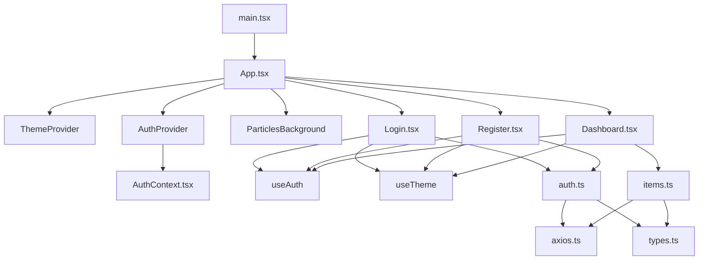

# wechat-admin 前端项目代码审查报告

## 基本信息

- **审查日期**: 2026-06-28
- **项目名称**: wechat-admin (React + TypeScript + Vite)
- **审查范围**: Projects/wechat-admin/frontend/src/ 目录下所有代码文件
- **文件数量**: 13 个 TypeScript/TSX 文件
- **报告版本**: v2.0

---

## 🎯 代码结构概览



---

## 🔍 发现的问题

| No. | 问题标题 | 严重程度 | 建议 | 代码位置 |
|-----|---------|---------|------|---------|
| 1 | 主题值类型验证不完整 | 🟡 中 | ThemeContext 对 localStorage 返回值的验证不足 | [ThemeContext.tsx#L16](file:///D:/Develop/CODE/AIWORK/Projects/wechat-admin/frontend/src/context/ThemeContext.tsx#L16) |
| 2 | API 基础 URL 硬编码 | 🟢 低 | baseURL 应根据环境变量配置 | [axios.ts#L4](file:///D:/Develop/CODE/AIWORK/Projects/wechat-admin/frontend/src/api/axios.ts#L4) |
| 3 | 调试代码残留 | 🟢 低 | axios 拦截器中的 console.error 可替换为日志服务 | [axios.ts#L28-48](file:///D:/Develop/CODE/AIWORK/Projects/wechat-admin/frontend/src/api/axios.ts#L28-48) |
| 4 | 重复的状态声明 | 🟢 低 | 主题切换在多个组件重复声明，可抽取 Layout 组件 | [Login.tsx#L18](file:///D:/Develop/CODE/AIWORK/Projects/wechat-admin/frontend/src/components/Login.tsx#L18) |

---

## 📝 详细问题分析

### 问题1：主题值类型验证不完整

**位置**: `ThemeContext.tsx` 第16行

```typescript
const [theme, setTheme] = useState<Theme>(() => {
  const stored = localStorage.getItem('theme');
  return (stored as Theme) || 'light';
});
```

**问题描述**: 代码假设 `localStorage.getItem('theme')` 返回的值一定是 `'light'` 或 `'dark'`。如果 localStorage 被手动修改或其他原因导致存储了其他值（如 `'blue'`），代码会接受这个无效值，可能导致样式问题。

**建议**: 添加值验证逻辑：

```typescript
const [theme, setTheme] = useState<Theme>(() => {
  const stored = localStorage.getItem('theme');
  if (stored === 'light' || stored === 'dark') {
    return stored;
  }
  return 'light';
});
```

**严重程度**: 🟡 中

---

### 问题2：API 基础 URL 硬编码

**位置**: `axios.ts` 第4行

```typescript
const api = axios.create({
  baseURL: 'http://localhost:3000/api',
  headers: {
    'Content-Type': 'application/json',
  },
});
```

**问题描述**: API 基础 URL 硬编码为 `http://localhost:3000/api`。在生产环境中需要不同的 API 地址，每次修改代码不现实。

**建议**: 使用环境变量配置：

```typescript
const api = axios.create({
  baseURL: import.meta.env.VITE_API_BASE_URL || 'http://localhost:3000/api',
  headers: {
    'Content-Type': 'application/json',
  },
});
```

**严重程度**: 🟢 低

---

### 问题3：调试代码残留

**位置**: `axios.ts` 第28-48行

```typescript
// 401 - Token 过期，清除本地存储并跳转登录页
if (response?.status === 401) {
  localStorage.removeItem('token');
  localStorage.removeItem('user');
  window.location.href = '/login';
  console.error('登录已过期，请重新登录');  // 第28行
}
// 403 - 权限不足
else if (response?.status === 403) {
  console.error('权限不足，请联系管理员');  // 第32行
}
// ... 更多 console.error
```

**问题描述**: 在 axios 拦截器中使用了多个 `console.error`，虽然这有助于调试，但在生产环境中可能不是最佳选择。更好的做法是使用统一的日志服务。

**建议**: 考虑使用专门的日志库（如 `loglevel`、`winston`）或创建一个日志工具函数，支持不同环境的日志级别控制。

**严重程度**: 🟢 低

---

### 问题4：重复的状态声明

**位置**: `Login.tsx` 第18行、`Register.tsx` 第19行、`Dashboard.tsx` 第22行

```typescript
const { theme, toggleTheme } = useTheme();
```

**问题描述**: 在 Login、Register 和 Dashboard 组件中都重复声明了 `theme` 和 `toggleTheme`。虽然这不影响功能，但增加了代码冗余，且主题切换按钮在每个页面都需要手动添加。

**建议**: 可以考虑创建一个 Layout 组件统一处理主题切换和粒子背景，所有页面共享：

```typescript
const Layout = ({ children }) => (
  <>
    <ParticlesBackground />
    <div className="relative z-10 min-h-screen">
      {children}
      <button onClick={toggleTheme} className="theme-toggle-btn">
        {theme === 'light' ? '🌙' : '☀️'}
      </button>
    </div>
  </>
);
```

**严重程度**: 🟢 低

---

## ✅ 代码优点

1. **完善的用户认证系统**: 登录、注册、登出流程完整，包含 token 管理
2. **健壮的错误处理**: 区分不同类型的 HTTP 错误（401/403/404/500），提供友好的错误提示
3. **密码强度验证**: Register 组件包含完整验证（长度≥8，大小写字母，数字）
4. **请求取消机制**: Dashboard 使用 `AbortController` 防止内存泄漏和状态更新错误
5. **主题切换功能**: 支持亮色/暗色模式，数据持久化到 localStorage
6. **视觉效果增强**: 添加粒子背景效果，提升界面美观度
7. **TypeScript 类型安全**: 所有组件和函数都有完整的类型定义，无 any 类型
8. **React 最佳实践**:
   - 使用 `useCallback` 优化回调函数
   - 正确清理副作用（useEffect return）
   - 使用 `AbortController` 取消请求
9. **中文本地化**: UI 文本使用中文，符合目标用户习惯
10. **自定义确认对话框**: 替代原生 confirm，保持界面风格一致
11. **localStorage 安全处理**: AuthContext 有 try-catch 保护 JSON.parse
12. **RESTful API 设计**: items API 设计合理，getItems 和 getItem 分离

---

## 📊 总结

### 问题严重程度分布

| 严重程度 | 数量 | 占比 |
|---------|------|-----|
| 🔴 高 | 0 | 0% |
| 🟡 中 | 1 | 25% |
| 🟢 低 | 3 | 75% |

### 总体评价

**优秀** - 代码质量非常高，具备生产级别的水准。项目采用了 React 最佳实践，包括：
- 完善的错误处理机制
- TypeScript 类型安全
- 请求生命周期管理
- 主题系统
- 用户认证流程

新发现的4个问题都是低/中优先级的优化建议，不影响核心功能。建议优先处理问题1（主题值类型验证），其他问题可根据项目需求决定是否实施。

---

## 📁 审查文件列表

| 文件路径 | 行数 | 功能描述 |
|---------|------|---------|
| [api/types.ts](file:///D:/Develop/CODE/AIWORK/Projects/wechat-admin/frontend/src/api/types.ts) | 47 | TypeScript 类型定义 |
| [api/axios.ts](file:///D:/Develop/CODE/AIWORK/Projects/wechat-admin/frontend/src/api/axios.ts) | 54 | axios 配置和拦截器 |
| [api/auth.ts](file:///D:/Develop/CODE/AIWORK/Projects/wechat-admin/frontend/src/api/auth.ts) | 17 | 认证相关 API |
| [api/items.ts](file:///D:/Develop/CODE/AIWORK/Projects/wechat-admin/frontend/src/api/items.ts) | 27 | 项目管理 API |
| [context/AuthContext.tsx](file:///D:/Develop/CODE/AIWORK/Projects/wechat-admin/frontend/src/context/AuthContext.tsx) | 62 | 认证状态管理 |
| [context/ThemeContext.tsx](file:///D:/Develop/CODE/AIWORK/Projects/wechat-admin/frontend/src/context/ThemeContext.tsx) | 41 | 主题状态管理 |
| [components/Login.tsx](file:///D:/Develop/CODE/AIWORK/Projects/wechat-admin/frontend/src/components/Login.tsx) | 101 | 登录组件 |
| [components/Register.tsx](file:///D:/Develop/CODE/AIWORK/Projects/wechat-admin/frontend/src/components/Register.tsx) | 139 | 注册组件 |
| [components/Dashboard.tsx](file:///D:/Develop/CODE/AIWORK/Projects/wechat-admin/frontend/src/components/Dashboard.tsx) | 209 | 仪表盘组件 |
| [components/ParticlesBackground.tsx](file:///D:/Develop/CODE/AIWORK/Projects/wechat-admin/frontend/src/components/ParticlesBackground.tsx) | - | 粒子背景组件 |
| [App.tsx](file:///D:/Develop/CODE/AIWORK/Projects/wechat-admin/frontend/src/App.tsx) | 66 | 应用入口组件 |
| [main.tsx](file:///D:/Develop/CODE/AIWORK/Projects/wechat-admin/frontend/src/main.tsx) | 10 | React 应用入口 |
| [index.css](file:///D:/Develop/CODE/AIWORK/Projects/wechat-admin/frontend/src/index.css) | - | 全局样式 |

---

**报告生成时间**: 2026-06-28
**报告版本**: v2.0