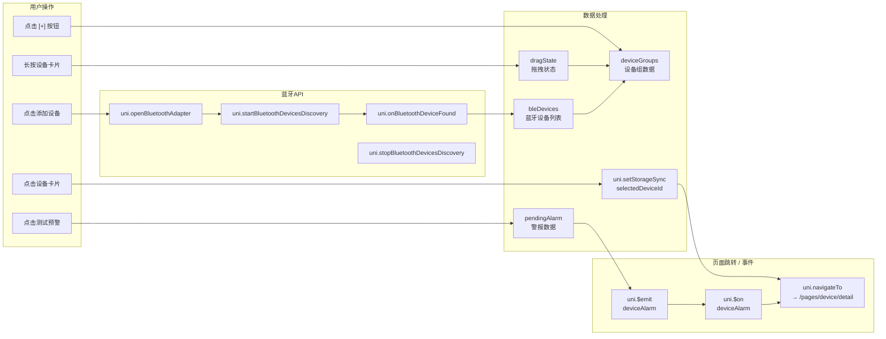
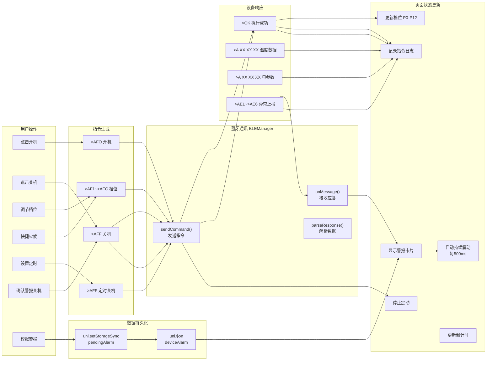
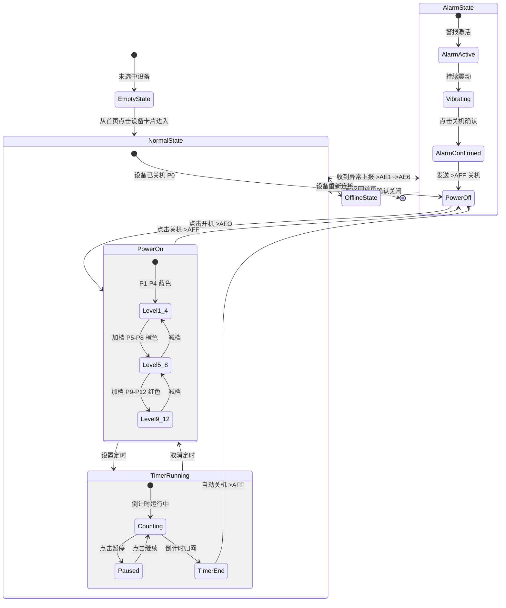
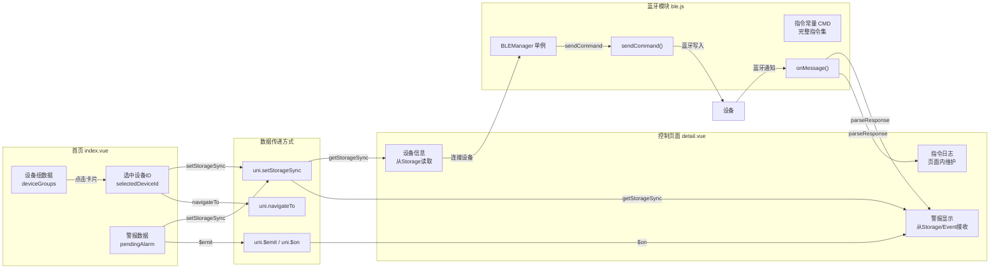

# 页面设计图 - 组件关系 / 数据流 / 状态图

> 使用 Mermaid 语法绘制，需安装 VS Code 插件 `bierner.markdown-mermaid` 预览

---

## 一、首页（index.vue）

### 1.1 首页组件关系图

```mermaid
graph TB
    subgraph "首页 index.vue"
        direction TB
        
        Header["顶部导航栏<br/>Header"]
        DropdownMenu["下拉菜单<br/>DropdownMenu"]
        EmptyState["空状态<br/>EmptyState"]
        DeviceGroup["设备组列表<br/>DeviceGroup"]
        DeviceCard["设备卡片<br/>DeviceCard"]
        DragFloat["拖拽浮动层<br/>DragFloat"]
        AddDeviceModal["添加设备弹窗<br/>AddDeviceModal"]
        TestAlarm["测试预警<br/>TestAlarm"]
        CustomTabbar["底部导航栏<br/>CustomTabbar"]
        
        Header --> DropdownMenu
        DeviceGroup --> DeviceCard
        DeviceGroup --> DragFloat
        AddDeviceModal --> DeviceCard
        TestAlarm --> DeviceCard
    end

    subgraph "下拉菜单 DropdownMenu"
        direction TB
        CreateGroup["📁 创建设备组"]
        AddDevice["📡 添加设备"]
        DeleteGroup["🗑️ 删除设备组"]
    end

    subgraph "添加设备弹窗 AddDeviceModal"
        direction TB
        BleScan["蓝牙扫描状态<br/>脉冲波纹动画"]
        BleResults["设备列表<br/>名称 + MAC + RSSI"]
        TestDevice["添加测试设备<br/>4种类型循环"]
    end

    subgraph "设备卡片 DeviceCard"
        direction TB
        CardIcon["设备图标 🔥/🍖"]
        CardName["设备名称<br/>点击可编辑"]
        CardStatus["状态文字<br/>P0-P12 · 运行中/已停火/离线"]
        HeatBar["12格档位进度条<br/>蓝/橙/红三色"]
        CloseBtn["删除按钮 ✕"]
    end
```



### 1.2 首页数据流图



### 1.3 首页状态图

```mermaid
stateDiagram-v2
    [*] --> EmptyState: 首次进入<br/>无设备组无设备
    
    EmptyState --> NormalState: 添加设备或创建设备组
    
    state NormalState {
        [*] --> GroupCollapsed: 默认收起
        GroupCollapsed --> GroupExpanded: 点击组标题
        GroupExpanded --> GroupCollapsed: 再次点击组标题
        
        state GroupExpanded {
            [*] --> HasDevices: 有设备
            HasDevices --> Dragging: 长按1秒+移动>20px
            Dragging --> HasDevices: 手指抬起
            HasDevices --> Scanning: 点击添加设备
            Scanning --> HasDevices: 扫描完成/添加设备
        }
        
        GroupExpanded --> EmptyGroup: 组内无设备
    end
    
    NormalState --> OfflineState: 设备离线
    OfflineState --> NormalState: 设备上线
    
    NormalState --> AlarmTriggered: 点击测试预警
    state AlarmTriggered {
        [*] --> SelectDevice: 选择设备
        SelectDevice --> SelectAlarmType: 选择异常类型
        SelectAlarmType --> NavigateToControl: 跳转控制页
    }
    
    NormalState --> [*]: 退出APP
```

---

## 二、控制页面（detail.vue）

### 2.1 控制页面组件关系图

```mermaid
graph TB
    subgraph "控制页面 detail.vue"
        direction TB
        TopNav["顶部导航栏<br/>← 返回 | 设备名 | [···]"]
        PowerControl["开关机控制<br/>PowerControl"]
        HeatControl["火候控制<br/>HeatControl"]
        TimerTask["定时任务<br/>TimerTask"]
        AlarmArea["异常警报<br/>AlarmArea"]
        CommandLog["指令日志<br/>CommandLog"]
        MoreMenu["更多菜单<br/>MoreMenu"]
        BottomTab["底部导航栏<br/>CustomTabbar"]
        
        TopNav --> MoreMenu
        PowerControl --> HeatControl
        HeatControl --> TimerTask
        TimerTask --> AlarmArea
        AlarmArea --> CommandLog
    end

    subgraph "火候控制 HeatControl"
        direction TB
        MinusBtn["[−] 减档按钮<br/>支持长按连续减"]
        PlusBtn["[+] 加档按钮<br/>支持长按连续加"]
        PowerDisplay["档位显示 P0-P12"]
        ProgressBar["12格进度条<br/>蓝/橙/红三色"]
        QuickBtns["快捷火候按钮"]
        
        QuickBtns --> SmallFire["小火 P3"]
        QuickBtns --> MediumFire["中火 P6"]
        QuickBtns --> LargeFire["大火 P9"]
        QuickBtns --> BoostFire["爆炒 P12"]
    end

    subgraph "定时任务 TimerTask"
        direction TB
        Countdown["倒计时显示 MM:SS"]
        PauseBtn["暂停/继续按钮"]
        CancelBtn["取消按钮"]
        AddTimer["添加定时任务<br/>1-60分钟"]
    end

    subgraph "异常警报 AlarmArea"
        direction TB
        AlarmCard["警报卡片 🔴<br/>红色背景+边框"]
        AlarmShutdown["关机按钮<br/>发送 >AFF"]
        SimulateAlarm["模拟警报按钮"]
        
        AlarmCard --> AlarmType1["机芯超温 >AE1"]
        AlarmCard --> AlarmType2["线盘超温 >AE2"]
        AlarmCard --> AlarmType3["过流保护 >AE3"]
        AlarmCard --> AlarmType4["电流异常 >AE4"]
        AlarmCard --> AlarmType5["锅具异常 >AE5"]
        AlarmCard --> AlarmType6["线盘测温开路 >AE6"]
    end

    subgraph "指令日志 CommandLog"
        direction TB
        LogEntry1["时间戳 + 操作描述 + 指令原文"]
        LogEntry2["..."]
        LogEntryN["..."]
    end
```



### 2.2 控制页面数据流图



### 2.3 控制页面状态图



---

## 三、页面间数据流总图



---

> **生成工具**: Mermaid
> **预览方式**: VS Code 安装 `bierner.markdown-mermaid` 插件后，在Markdown预览中查看
> **版本**: v1.1 | 2026-06-24
